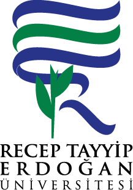

# 🧠 OptikZeka — Optik Form Okuma ve Değerlendirme Sistemi

<p align="center">
  
</p>

<p align="center">
  <b>PyQt6 + OpenCV ile geliştirilmiş, profesyonel düzeyde optik okuyucu ve sınav değerlendirme sistemi.</b>
</p>

<p align="center">
  
  
  
  
  
</p>

---

## 📌 Proje Hakkında

**OptikZeka**, okullarda ve sınav merkezlerinde kullanılan kâğıt tabanlı optik formları (OMR — Optical Mark Recognition) dijital ortamda otomatik olarak okuyup değerlendiren, tamamen yerli geliştirme bir masaüstü uygulamasıdır.

Tarayıcıdan veya telefon kamerasından alınan optik form görüntülerini analiz ederek öğrenci cevaplarını tespit eder, cevap anahtarıyla karşılaştırır ve kişisel karne PDF'leri üretir.

---

## ✨ Temel Özellikler

### 📖 Optik Form Okuma (OMR Engine)
- OpenCV tabanlı gerçek zamanlı baloncuk (bubble) tarama motoru
- Görüntü hizalama: sınır kontur ve zamanlama işareti (timing mark) yöntemleri
- Eğim, X/Y kayma ve siyahlık/doluluk eşiği kalibrasyonu
- Çoklu şık tespiti (birden fazla şık işaretlenmişse `*` olarak geçersiz sayar)
- PDF dosyasından görüntüye toplu dönüştürme (PyMuPDF)

### 🗂️ Esnek Şablon Sistemi
- Sürükle-bırak tarzı görsel şablon editörü
- Sınırsız sayıda form şablonu tanımlama ve kaydetme (JSON tabanlı)
- Blok türleri: Cevap alanı, Öğrenci No, Kitapçık Grubu, Hizalama Çerçevesi, Başlık Alanı
- Tek dersli ve çok dersli (multi-lesson) sınav desteği
- Renk kanalı modu (Gri / Kırmızı / Yeşil / Mavi)

### 👨‍🎓 Öğrenci Yönetimi
- SQLite3 tabanlı öğrenci veritabanı
- Excel dosyasından toplu öğrenci aktarımı
- Ad/numara ile hızlı arama ve filtreleme

### ✅ Manuel Doğrulama ve Düzeltme Araçları
- **👁️ Eşik Maskesi Önizleme:** Motorun tam olarak neyi gördüğünü siyah-beyaz maske olarak canlı göster
- **✏️ Tabloda Cevap Düzeltme:** Hatalı okunan cevapları tabloda çift tıklayarak düzelt; puan ve istatistikler anında güncellenir
- **📖 Kitapçık Grubu Değiştirme:** Tabloda kitapçık hücresini düzenle, cevap anahtarı otomatik olarak yeniden yüklensin
- **🔍 Öğrenci Eşleştirme Penceresi:** Yanlış okunan numara için veritabanından hızlıca arama yap ve doğru öğrenciyi seç

### 📊 Raporlama ve Dışa Aktarım
- Kişiye özel karne PDF'i (tek ve toplu)
- Dinamik sütunlu soru tablosu (20 / 60 / 90 / 120 soruluk formlar)
- CSV formatında sonuç dışa aktarımı
- Sınıf/grup bazlı detaylı istatistik paneli
- Excel raporu dışa aktarımı

### ⌨️ Gelişmiş Klavye Kısayolları
Analiz akışını hızlandırmak için tam özelleştirilebilir kısayol tuşları:

| Eylem | Varsayılan Kısayol |
|---|---|
| Önceki Form | `Z` |
| Sonraki Form | `X` |
| Formu Oku / Analiz Et | `C` |
| Sonucu Kaydet | `V` |
| Öğrenci No'ya Odaklan | `B` |
| X Kaymayı Azalt / Artır | `A` / `Q` |
| Y Kaymayı Azalt / Artır | `W` / `S` |
| Eğimi Azalt / Artır | `D` / `E` |
| Siyahlığı Azalt / Artır | `F` / `R` |
| Doluluk Eşiğini Azalt / Artır | `G` / `T` |

---

## 🏗️ Proje Mimarisi

```
py_optik/
│
├── main.py                    # Ana uygulama mantığı ve olay yöneticileri
│
├── app/
│   ├── engine/
│   │   ├── processor.py       # OMR motoru (baloncuk tarama, hizalama)
│   │   └── pdf_converter.py   # PDF → Görüntü dönüştürücü
│   │
│   ├── ui/
│   │   └── main_window.py     # PyQt6 arayüz tanımı ve widget'ları
│   │
│   └── utils/
│       └── config.py          # Ayar ve yapılandırma yöneticisi
│
├── resources/                 # Uygulama kaynakları
├── sablonlar.json             # Kayıtlı form şablonları
├── shortcuts.json             # Klavye kısayol ayarları
├── requirements.txt           # Python bağımlılıkları
└── icon.ico                   # Uygulama ikonu
```

---

## 🚀 Kurulum ve Çalıştırma

### Gereksinimler
- Python 3.10 veya üzeri
- Windows 10 / 11

### Adımlar

```bash
# 1. Depoyu klonla
git clone https://github.com/erd5334/py_optik.git
cd py_optik

# 2. Sanal ortam oluştur ve aktif et
python -m venv venv
venv\Scripts\activate

# 3. Bağımlılıkları kur
pip install -r requirements.txt

# 4. Uygulamayı başlat
python main.py
```

### EXE Olarak Derleme (İsteğe Bağlı)

```bash
pip install pyinstaller
python -m PyInstaller OptikZeka_v1.0.spec --noconfirm
# Çıktı: dist/OptikZeka_v1.0.exe
```

---

## 🗄️ Veritabanı Yapısı

Uygulama, aynı dizinde bulunan `testcevaplari.db3` SQLite veritabanını kullanır.

| Tablo | Açıklama |
|---|---|
| `ogrbilgi` | Öğrenci bilgileri (numara, ad, birim, program) |

---

## 📋 Kullanım Akışı

```
1. Klasör Aç       →  Taranan form görüntülerinin bulunduğu klasörü seç
2. Şablon Seç      →  Forma uygun şablonu combo kutusundan seç
3. Kalibre Et      →  X/Y kayma, eğim, siyahlık ve doluluk eşiklerini ayarla
4. Analiz Et (C)   →  Formu oku; cevaplar tabloya, isim etikete yansısın
5. Doğrula         →  Gerekirse tabloda düzelt ya da öğrenci eşleştir
6. Kaydet (V)      →  Sonucu CSV'e kaydet
7. Karne           →  Tek ya da toplu PDF karne oluştur
8. Sonraki (X)     →  Bir sonraki forma geç ve tekrarla
```

---

## 📦 Bağımlılıklar

| Paket | Amaç |
|---|---|
| `PyQt6` | Masaüstü arayüzü |
| `opencv-python-headless` | Görüntü işleme ve OMR motoru |
| `numpy` | Sayısal hesaplamalar |
| `pymupdf` | PDF → PNG dönüştürme |
| `fpdf2` | Karne PDF üretimi |

---

## 🗺️ Yol Haritası (Planlanan Özellikler)

Gelecekte eklenmesi planlanan özellikler:

- [ ] **Dinamik Logo Desteği:** Karne PDF'inde kullanılan logonun sabit `logo.png` yerine şablon veya kullanıcı ayarları üzerinden değiştirilebilir hâle getirilmesi
- [ ] Toplu OMR okuma (birden fazla formu sırayla otomatik işleme)
- [ ] Ağ/sunucu tabanlı veritabanı desteği

---

## 🤝 Katkı

Bu proje şu an kişisel kullanım amaçlıdır. Hata bildirimleri ve öneriler için [Issues](https://github.com/erd5334/py_optik/issues) kısmını kullanabilirsiniz.

---

## 📄 Lisans

Bu proje MIT lisansı ile lisanslanmıştır.
